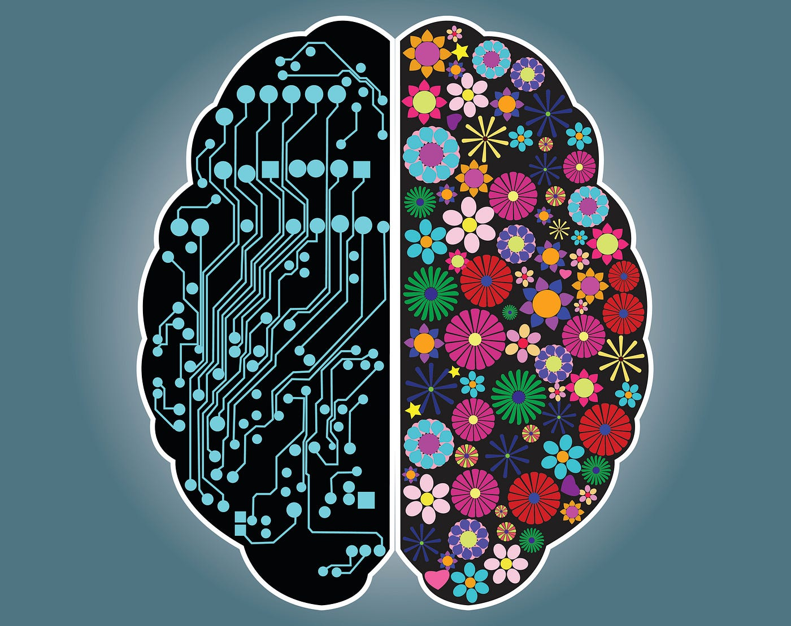

My interest in software engineering comes from a desire to see how technology can blend creativity with functionality. While I am still in early stages of exploring the concept, I have been drawn to designing websites using languages like HTML and CSS. For example, currently I have an ongoing project designing a digital cookbook. This project was what made me realize that perhaps my artistic side could give me an advantage in this field where I have usually found myself feeling inferior. For three years, I wrote project after project, not fully understanding why we were doing what we were doing. This project was what showed me that I can build things that are incredibly functional to me in my personal life. 

In the future, I hope to expand my skills beyond front-end design with a newfound passion in the subject. I want to learn many more programming languages, web frameworks, and back-end development to understand how complex systems work behind the scenes. However, I never want to stop implementing my creativity using software engineering. 

It is also important to me to grow my social and leadership skills. Being able to communicate with both the business and development sides of a company is a skill that I hope to bring to my future careers. I envision that I will be able to lead teams by balancing my technical skill with my interpersonal skills in an effort to merge art, technology, and human focused design.

Ultimately, I hope that my journey in software engineering will help me build systems that are both technologically advanced and aesthetically pleasing. I see it as a field where I can continue to grow as I learn more, creating work that is meaningful and fulfilling.

