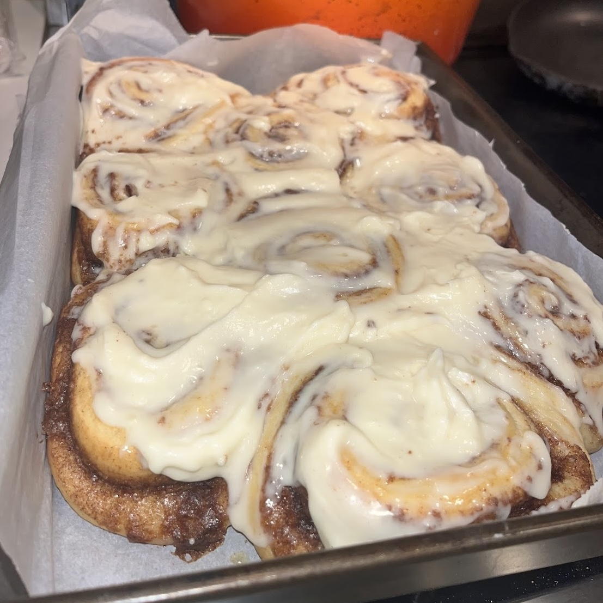

<!--  -->

  
  
  

"Cook Brooke's Cook Book" is a personal website I built from scratch using HTML, CSS, and JavaScript. 

I began building this as a solution to a problem I faced frequently in my personal life. Anyone who loves to cook knows the struggles of digital recipes. While the immense variety of any particular recipe on the internet is impressive, it becomes exhausting when trying to pick one to use. I find myself not able to decide on one of the hundreds of options, and once I pick, I can never find the same recipe again. Additionally, I, like many others, find it inexplicably frustrating when I have to scroll through the life story of the chef, on a page full of advertisments, before I can just see the ingredient list. All this coupled with the fact that almost all of my favorite family recipes are printed on tiny index cards, dirty from years of use, I knew it was time to figure out my own solution.

As the creator of this project, I was responsible for every aspect of the website, from designing, to to writing the code, and organizing the content in a visually appealing way. I implemented responsive design to ensure the cookbook could be viewed on any kind of device. I also experimented with interactive deatures such as links, 'back' buttons, and more. I plan on continuing to add to the website, not just new recipes, but more complex features as well. I am currently working on a function that allows users to adjust ingredient quantities based on the desired number of servings by automatically scaling the ingredient list.

This was my first time working in both HTML and CSS, but after doing a few courses on [freeCodeCamp](https://www.freecodecamp.org/learn/2022/responsive-web-design/), I was able to work through it. I learned all the basics of formatting in CSS, but more importantly I learned hands-on about the difficulties of project planning, website structuring, creating simple user experiences, and the technial execution of design visions.

Take a look at my cookbook: [Cook Brooke's Cook Book](https://brooke-hana.neocities.org/)

See my [github repo](https://github.com/brookeclifton/cookbook)!
