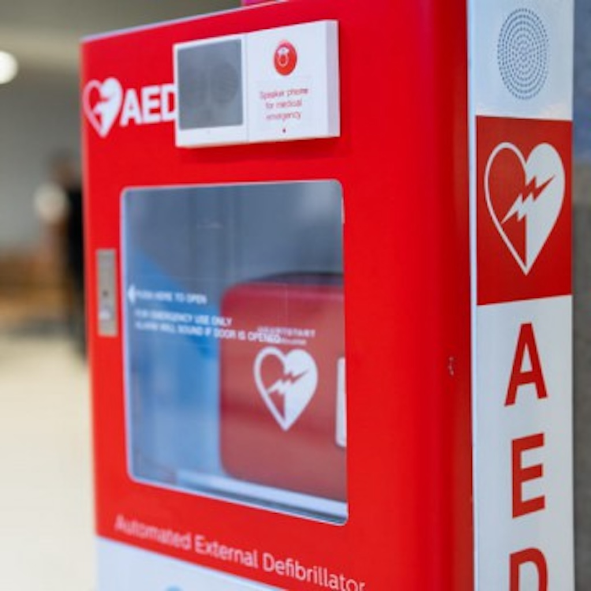

For my Girl Scout Gold Award, I led a community initiative to advocate for acessible AEDs at schools hosting the local kids' soccer league and educated students on their proper use to improve emergency preparedness. 

This project focused on increasing safety in my community by ensuring that defibrillators were available at schools even after refular hours, particularly for soccer league practices and events. I felt drawn to do this because at the time, I had been seeing so many stories of athletes going into cardiac arrest during games. Cardiac arrest can sneak up on even a healthy pro athlete. It often shows few symptoms. Therefore, when a player topples over on the pitch, the device that can easily save them is not the first thing that comes to most peoples minds. Observing my own surroundings, I realized that most schools keep their mandatory AED's locked in buildings after regular hours. So, I got started petitioning a few local school's administrations to improve their system. I educated them about the immediate action that needs to be taken in a cardiac event, and how it can be the difference between life or death. At each school, we were able to get an AED placed in close range of the sports fields, behind no locks. I then made book marks for the students of my school, informing them of what cardiac arrest looks like and where to go to find the defibrillators.

As the Gold Award is the penultimate independent goal of Girl Scout's, I was responsible for every aspect of this project, from budgeting, planning, pitching, initiating, finalizing, and finally pitching for the award itself. This project required project organizing, communication with people in leadership positions, reasearch, designing supporting materials, and management. Through this project, I developed my skills in all of these matters. I was able to develop a multi-step project that made a lasting impact on my community. Overall, leading an initiative which combined technical skill, social engagement, and problem solving gave me a new level of confidence and knowledge. 

See my Gold Award certification [here](https://www.credly.com/badges/5ff7f26f-015b-4bee-81ff-49906cef79d9/linked_in?t=t1of7j)!
 
