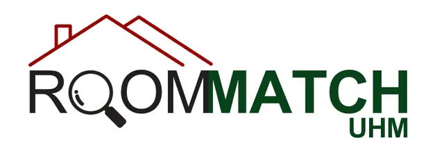
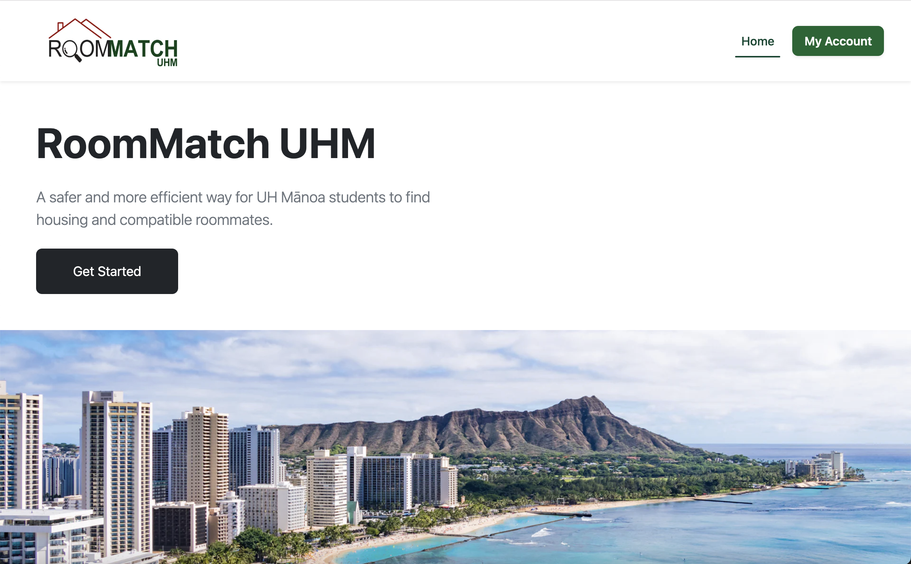
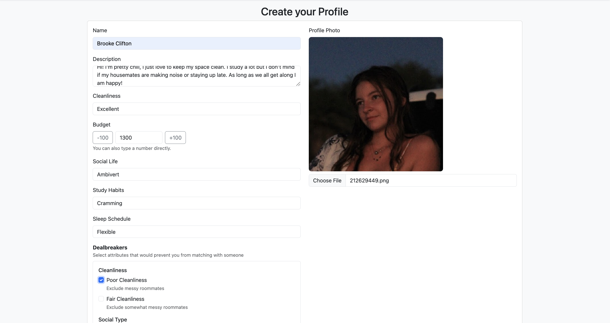
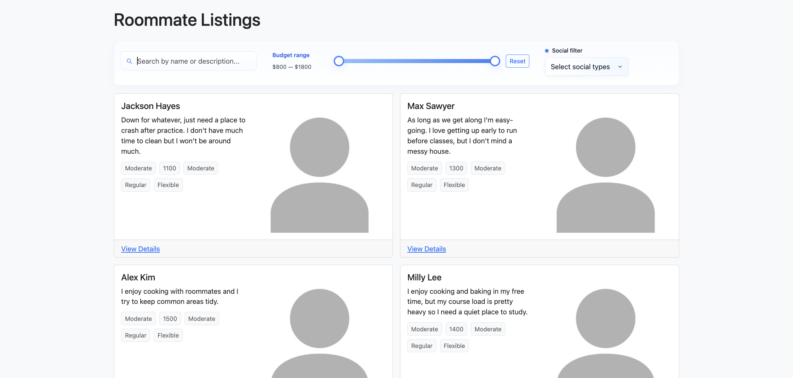
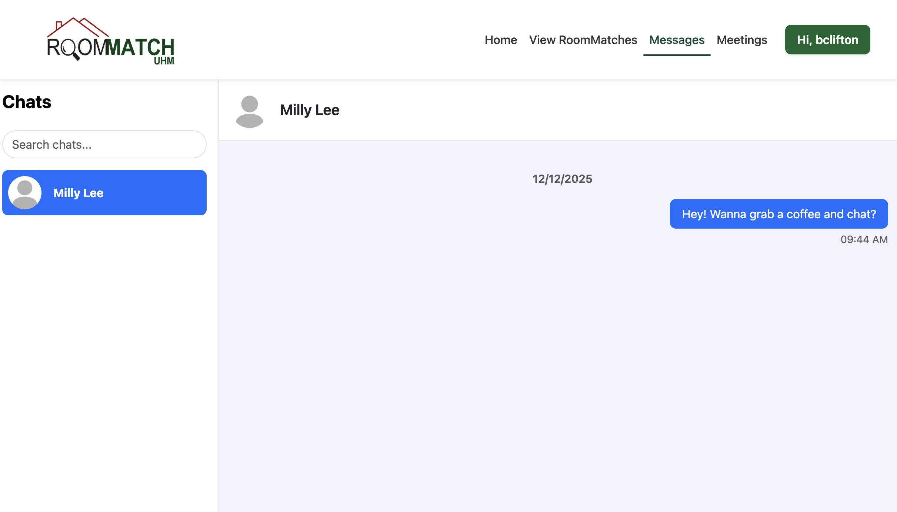
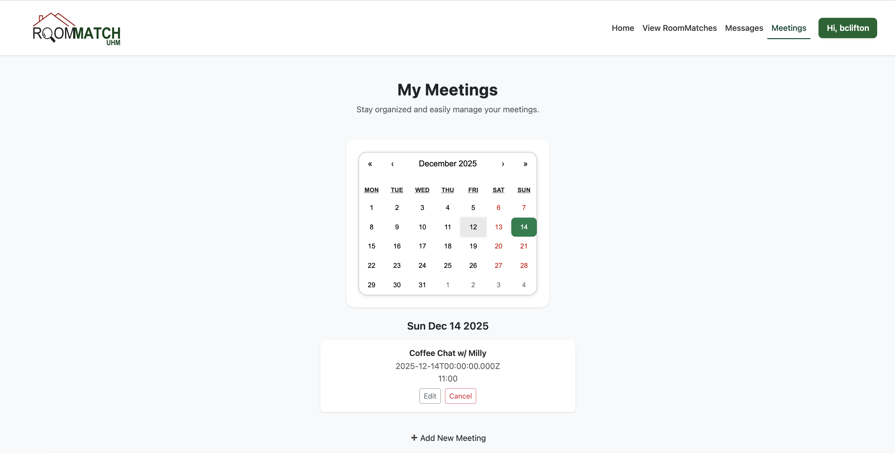

## Project Overview

<strong>[RoomMatch UHM](https://roommatch-uhm-v1-pmogt97u1-roommatch-uhm.vercel.app/)</strong> is a web application designed to help Univeristy of Hawai'i at Manoa students find compatible roommates. The platform allows users to create detailed profiles, browse their matches, view compatibility scores, and communicate directly with potential roommates through an integrated chat system. The goal of the project was to apply software engineering principles learned in class to a real-world problem while working collaboratively in a team environment.

The application was built using Next.js, React, Bootstrap, Prisma, and PostgreSQL, with deployment handled through Vercel.

## My Contributions 

I was responsible for several key technical components of the project, including:
<ul>
  <li>Writing and maintaining database seed scripts to populate realistic user data for development and testing</li>
  <li>Implementing and debugging profile and listing data flows to ensure users appeared correctly across browse and match views</li>
  <li>Assisting with frontend integration, ensuring backend data was correctly consumed by React components</li>
  <li>Managing GitHub issues and branches, resolving merge conflics and coordinating feature integration</li>
</ul>
I also contributed to debugging deployment and environment issues, ensuring the application behaved consistently across local and deployed environments.

## What I learned

This project reinforced that building a web application is about more than just writing code. I gained hands-on experience with:
<ul>
  <li>Collaborative software engineering, including working with shared codebases, pull requests, and issue-driven development</li>
  <li>The importance of clear data between frontend and backend systems</li>
  <li>Managing debugging problems that arise when multiple systems interact</li>
  <li>Translating evolving requirements into working software</li>
</ul>
Most importantly, I learned how critical communication and organization are when developing software as a team.

## Source Code

View our GitHub organization repository here:
[github.com/roommatch-uhm](https://github.com/roommatch-uhm )
This repository contains the full source code, issue history, and project documentation.

## Landing Page

## Create Profile

## Match Listings Page

## Messaging Page

## Meetings Page

