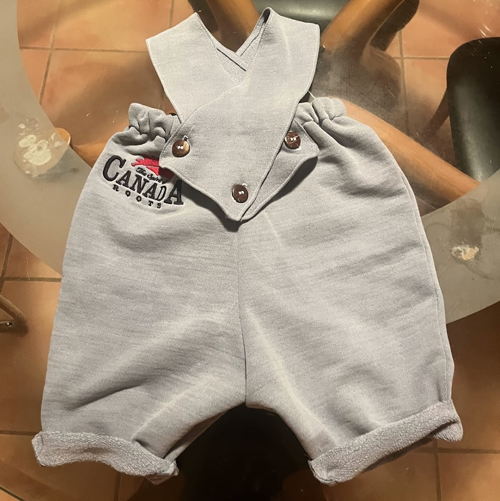
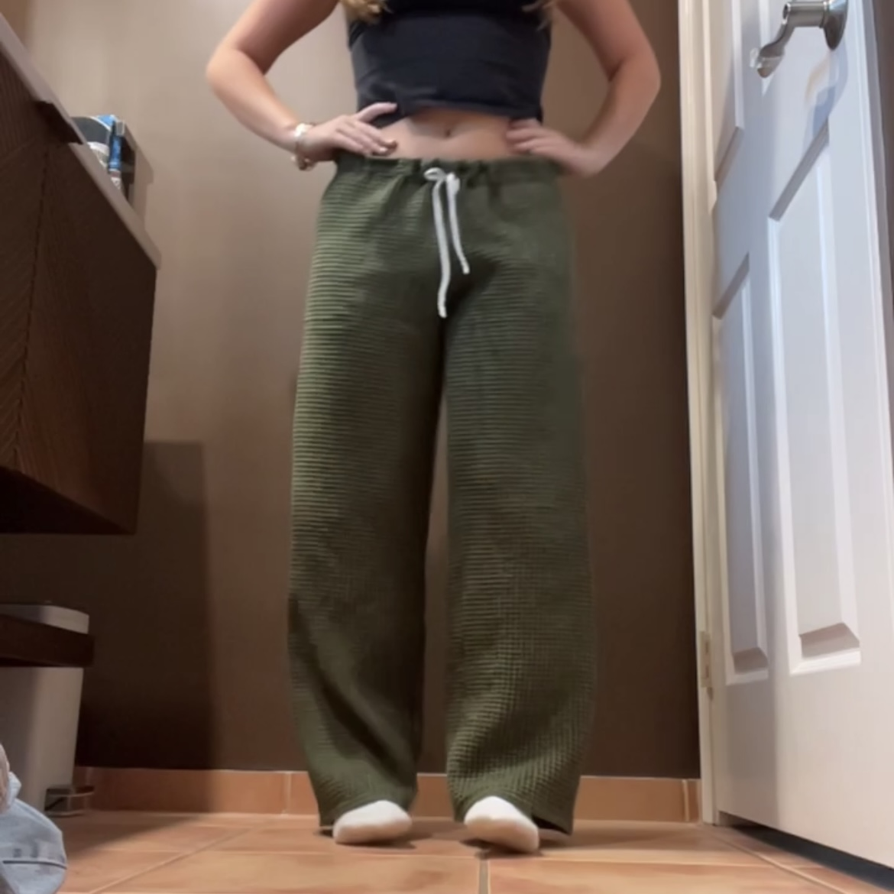

  
  
  

If you had told me at age twelve that I would one day grow up proud to see myself reflected in my grandmother, I probably would have doubted you. She could be tough on us when we were kids, and I never took the time to understand her while she was around. Yet as the years pass, it has become abundantly clear just how much of her lives on in me, and how grateful I am for it.

Most recently, I've taken up her lifelong hobby: sewing. She was a master at it, and now, as I sit in front of my sewing machine, I often feel as though her energy is guiding me. Teaching myself to sew, without formal instruction other than memories of her trying to teach me in my youth, has made me a far more detail oriented and observant person. When I am in a clothing store, I no longer simply reach for something I like, but instead I pause to study how it was constructed, what fabric was chosen, and how I might recreate or improve it. After recieving my sewing machine last holiday season, I spent nearly all of winter break experimenting, practicing, and creating. When summer break arrived, I found myself back at it, often spending at least two hours each evening refining my skills.

In the beginning, I had plenty of enthusiasm but very little confidence that I could produce anything wearable. However, after ruining plenty of fabric, and being disappointed time and time again, I finally started to impress myself with the pieces I was able to make. 

Once I grew confortable with my abilities, I made myself a tailored dress and a pair of linen pants. I sewed birthday gifts for my friends, and even made a tiny outfit with a matching toy for my new nephew. Over the course of the past year, sewing has taught me countless lessons about craftmanship, patience, and creativity. Beyond the technical skills, it has helped me let go of perfectionism, embrace the learning process, and appreciate the satisfaction that comes from making something from scratch. 
